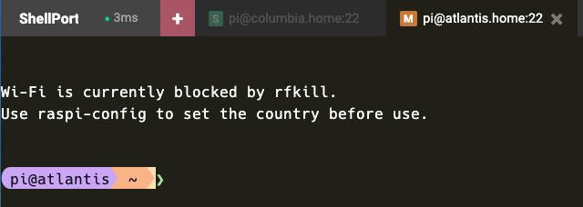

# ShellPort

Browser-based remote shell access over SSH, Telnet, and Mosh



## Supported browsers

ES2020-era browsers and newer, including Chrome 80+, Edge 80+, Firefox 78+, and Safari 14+.

## Docker

Run ShellPort with Docker Compose:

```yaml
services:
  shellport:
    image: ghcr.io/snuffy2/shellport:latest
    container_name: shellport
    restart: unless-stopped
    ports:
      - "8182:8182"
    volumes:
      - ./config:/etc/shellport
    environment:
      SHELLPORT_CONFIG: /etc/shellport/shellport.conf.json
      # Optional: base64-encoded 32-byte key for encrypted preset passwords.
      # Generate with: openssl rand -base64 32
      # SHELLPORT_PRESET_SECRET_KEY: "replace-with-generated-key"
```

Then open `http://localhost:8182`.

For reverse proxy deployments, publish the service only on localhost:

```yaml
ports:
  - "127.0.0.1:8182:8182"
```

## Configuration

ShellPort can be configured with a JSON configuration file or environment variables. See [CONFIGURATION.md](CONFIGURATION.md) for the full configuration reference.

The Docker Compose example above mounts `./config` as a writable configuration directory and points `SHELLPORT_CONFIG` at `shellport.conf.json` inside it. Start from [shellport.conf.example.json](shellport.conf.example.json) when creating your own configuration.

Writable file-backed configuration enables preset updates from the UI, such as saving SSH/Mosh fingerprints. If `SHELLPORT_PRESET_SECRET_KEY` is set, plaintext preset `Password` values are migrated on startup to `Encrypted Password` and the plaintext value is removed from the JSON file. That key must be set through the environment, not in JSON. Without that key, plaintext password presets continue
to work as before. Full preset add/edit/remove API writes require admin access. The current authentication UI accepts `SharedKey` only. `AdminKey` grants admin access for the preset config API, but there is not yet a separate UI prompt for entering it. If `AdminKey` is blank, `SharedKey` grants admin access. If both keys are blank, everyone gets admin access without authentication. Fingerprint saves from the current UI remain limited to the selected preset's fingerprint.

Generate a preset secret key with one of these commands:

#### macOS/Linux

```sh
openssl rand -base64 32
```

#### Windows PowerShell

```powershell
$rng = [Security.Cryptography.RandomNumberGenerator]::Create()
$bytes = New-Object byte[] 32
$rng.GetBytes($bytes)
[Convert]::ToBase64String($bytes)
```

Mosh support is available with SSH used for bootstrap only. The browser connection to ShellPort still uses WebSocket, while Mosh data flows over UDP between the backend container and the remote host. Remote hosts need `mosh-server` installed, SOCKS5 is not supported for Mosh, the backend-to-host Mosh leg is IPv4-only, and terminal encoding is fixed to UTF-8.

<details>
<summary><h2>Running From Source</h2></summary>

Use this path for development.

Prerequisites:

- `git`
- `go`
- `node` 24 or newer
- `npm`

Build the frontend assets and backend binary:

```sh
git clone https://github.com/Snuffy2/shellport.git
cd shellport
npm ci
npm run build
```

Run the development server:

```sh
npm run dev
```

The development command starts the Go backend with `shellport.conf.example.json` and serves the frontend through Vite with HMR. Vite proxies backend routes such as `/shellport/socket` to the Go process.

The generated production binary is written to `./shellport` by `npm run build`.

Useful development checks:

```sh
npm run generate
npm run testonly
npm run lint
go test ./...
```

`npm run generate` produces the Vite assets and then refreshes the embedded Go static assets.

</details>

## Fork

This repository is a fork of [nirui/sshwifty](https://github.com/nirui/sshwifty). The original project and its design are the work of [@nirui](https://github.com/nirui), whose excellent work made this possible.


## License

Code in this project is licensed under AGPL-3.0-only. See [LICENSE.md](LICENSE.md) for details.

Third-party components are licensed under their respective licenses. See [DEPENDENCIES.md](DEPENDENCIES.md) for dependency copyright and license details.
